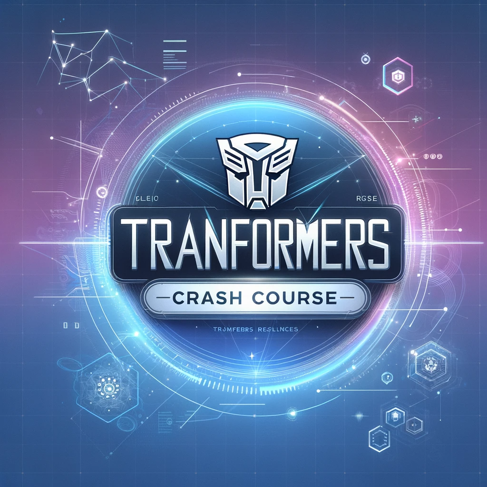

# Transformer Tutorials

A collection of tutorials and notebooks explaining the basics of transformer models in deep learning.

<p align="center">
  
</p>


# Transformer Tutorials

A comprehensive collection of tutorials guiding you from the basics of transformers to advanced applications and research topics.

## 📚 Table of Contents

### 🌱 Basics and Introduction
- [Introduction to Transformers](./notebooks/01_Introduction_to_Transformers.ipynb)
- [Understanding the Transformer Architecture](./notebooks/02_Understanding_the_Transformer_Architecture.ipynb)
- [Working with HuggingFace's Transformers Library](./notebooks/03_Working_with_HuggingFaces_Transformers_Library.ipynb)
- [Tokenization Deep Dive](./notebooks/04_Tokenization_Deep_Dive.ipynb)
- [Embeddings in Transformers](./notebooks/05_Embeddings_in_Transformers.ipynb)

### 🚀 Intermediate Topics
- [Fine-tuning Transformers for Text Classification](./notebooks/06_Fine_tuning_Transformers_for_Text_Classification.ipynb)
- [Sequence-to-Sequence Tasks with Transformers](./notebooks/07_Sequence_to_Sequence_Tasks_with_Transformers.ipynb)
- [Named Entity Recognition with Transformers](./notebooks/08_Named_Entity_Recognition_with_Transformers.ipynb)
- [Question Answering Systems with Transformers](./notebooks/09_Question_Answering_Systems_with_Transformers.ipynb)
- [Transformers for Text Generation](./notebooks/10_Transformers_for_Text_Generation.ipynb)
- [Sentiment Analysis with Transformers](./notebooks/11_Sentiment_Analysis_with_Transformers.ipynb)
- [Transformers in Computer Vision](./notebooks/12_Transformers_in_Computer_Vision.ipynb)
- [Handling Long Sequences with Transformers](./notebooks/13_Handling_Long_Sequences_with_Transformers.ipynb)
- [Transfer Learning and Transformers](./notebooks/14_Transfer_Learning_and_Transformers.ipynb)

### 🔬 Advanced Topics
- [Customizing Transformer Architectures](./notebooks/15_Customizing_Transformer_Architectures.ipynb)
- [Efficient Training of Transformers](./notebooks/16_Efficient_Training_of_Transformers.ipynb)
- [Optimizing Transformers for Production](./notebooks/17_Optimizing_Transformers_for_Production.ipynb)
- [Transformers for Non-NLP Tasks](./notebooks/18_Transformers_for_Non_NLP_Tasks.ipynb)
- [Attention Mechanisms Explored](./notebooks/19_Attention_Mechanisms_Explored.ipynb)
- [Positional Encodings and Variants](./notebooks/20_Positional_Encodings_and_Variants.ipynb)
- [Regularization Techniques for Transformers](./notebooks/21_Regularization_Techniques_for_Transformers.ipynb)
- [Multi-modal Transformers](./notebooks/22_Multi-modal_Transformers.ipynb)
- [Transformer Variants and Evolutions](./notebooks/23_Transformer_Variants_and_Evolutions.ipynb)
- [Knowledge Distillation in Transformers](./notebooks/24_Knowledge_Distillation_in_Transformers.ipynb)
- [Zero and Few-shot Learning with Transformers](./notebooks/25_Zero_and_Few-shot_Learning_with_Transformers.ipynb)

### 🌐 Specialized Applications and Exploration
- [Transformers in Bioinformatics](./notebooks/26_Transformers_in_Bioinformatics.ipynb)
- [Transformers in Finance](./notebooks/27_Transformers_in_Finance.ipynb)
- [Attention Visualization](./notebooks/28_Attention_Visualization.ipynb)
- [Bias, Ethics, and Fairness in Transformer Models](./notebooks/29_Bias_Ethics_and_Fairness_in_Transformer_Models.ipynb)
- [Large Scale Training of Transformers](./notebooks/30_Large_Scale_Training_of_Transformers.ipynb)
- [Reinforcement Learning with Transformers](./notebooks/31_Reinforcement_Learning_with_Transformers.ipynb)
- [Transformers for Audio](./notebooks/32_Transformers_for_Audio.ipynb)
- [Knowledge Graphs and Transformers](./notebooks/33_Knowledge_Graphs_and_Transformers.ipynb)
- [Transformers in Healthcare](./notebooks/34_Transformers_in_Healthcare.ipynb)
- [Multilingual and Cross-lingual Transformers](./notebooks/35_Multilingual_and_Cross-lingual_Transformers.ipynb)
- [Adversarial Attacks on Transformers](./notebooks/36_Adversarial_Attacks_on_Transformers.ipynb)
- [Real-time Applications of Transformers](./notebooks/37_Real-time_Applications_of_Transformers.ipynb)
- [Transformers for the Web](./notebooks/38_Transformers_for_the_Web.ipynb)
- [Generative Art with Transformers](./notebooks/39_Generative_Art_with_Transformers.ipynb)
- [Future of Transformers](./notebooks/40_Future_of_Transformers.ipynb)


## 🛠 Setting Up the Local Environment

To run the tutorials and notebooks on your local machine, follow these steps:

### 1. Clone the Repository

First, clone the repository to your local machine:

```bash
git clone https://github.com/YOUR_USERNAME/transformer-tutorials.git
cd transformer-tutorials
```

Replace YOUR_USERNAME with your actual GitHub username.


### 2. Set Up a Virtual Environment (Optional but Recommended)
Using a virtual environment helps manage dependencies and ensures that the packages installed don't interfere with packages for other projects.

If you don't have venv module installed, you can do so using:

```bash
pip install virtualenv
```

Now, create and activate the virtual environment:

For macOS and Linux:

```bash
python -m venv venv
source venv/bin/activate
```

For Windows:

```bash
python -m venv venv
.\venv\Scripts\activate
```

### 3. Install Necessary Packages
With the virtual environment activated, install the required packages:

```bash
pip install -r requirements.txt
```

### 4. Launch Jupyter Notebook
You can now launch Jupyter Notebook to access and run the tutorials:

```bash
jupyter notebook
```

This will open a tab in your web browser where you can navigate to the desired notebook and run it.

### 5. Deactivate the Virtual Environment
Once you're done, you can deactivate the virtual environment and return to your global Python environment by simply running:

```bash
deactivate
```

## 🚀 How to Use
Follow the steps in "Setting Up the Local Environment" to set up your machine.
Navigate to the desired notebook and run it using Jupyter Notebook.

## 🤝 Contributions
Feel free to submit pull requests or raise issues if you find any problems or have suggestions.

## 📜 License
MIT License
